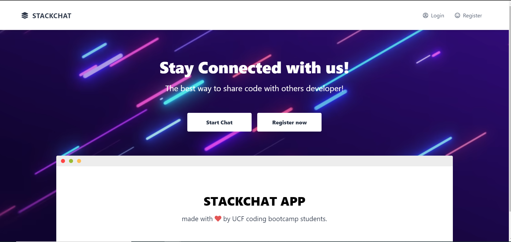
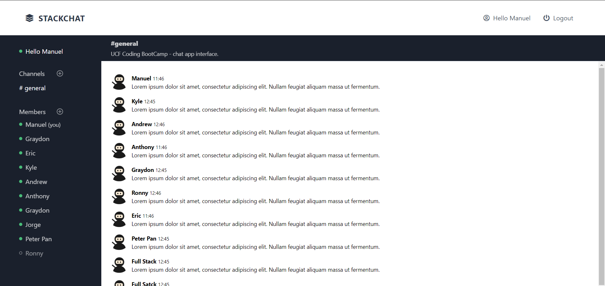

# #STACKCHAT APP 🚀
 

## Description
The purpose of this application is to provide code developers with a quick and easy way to share and discuss their code with
their colleagues and like-minded individuals. We created the interface to be simple and easy to use, to make it appealing to
those who just want to sign in and get to chatting. To aid with this, we implemented the Google Sign-In API, to make signing in 
as easy as possible!

## Prerequisites
The latest version of your web browser is needed, Google Chrome is highly recommended.
If you fork or clone this repo, be sure to npm init and npm install before running the server!

## Technologies
HTML was used to build the interface, Tailwind was used to style it, and javascript and MYSQL powers it.

## Table of Contents
* [Installation](#installation) 
 
* [Usage](#usage) 
 
* [License](#license) 
 
* [Contributing](#contributing) 
 
* [Tests](#tests) 
 
* [Questions](#questions) 

## Installation
​
To install necessary dependencies, run the following command:
​
npm install
​
## Usage
​
Run "node server.js" to start the server localhost:8080
​

## Demo
​
To see my work: https://ucfstackchat.herokuapp.com/

## License
​
This project is licensed under the MIT license.
  
## Contributing
​
[FullStackForce]('https://github.com/FullStackForce') 

## Tests
​
To run tests, run the following command:
​
npm test
​
## Questions
​

If you have any questions about the repo, open an issue or contact [FullStackForce](https://github.com/FullStackForce) directly at.